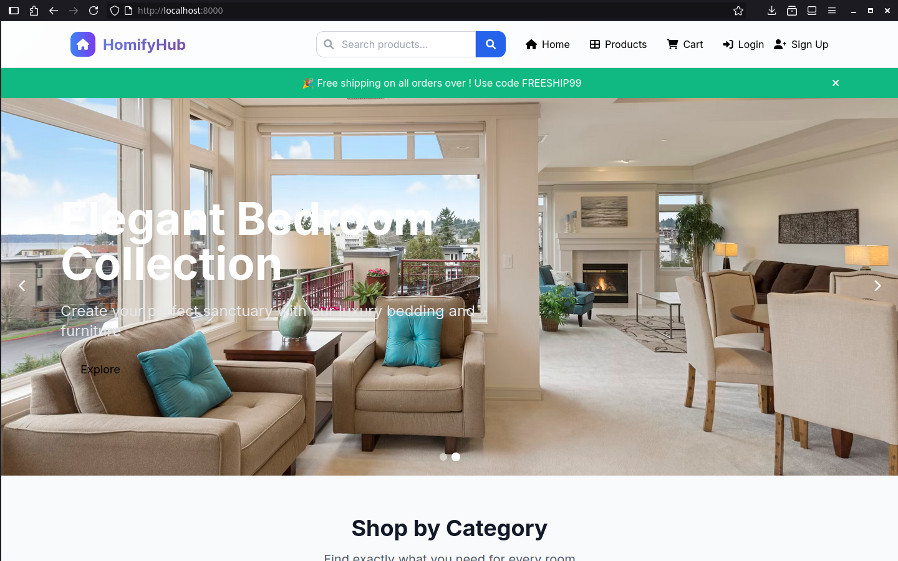
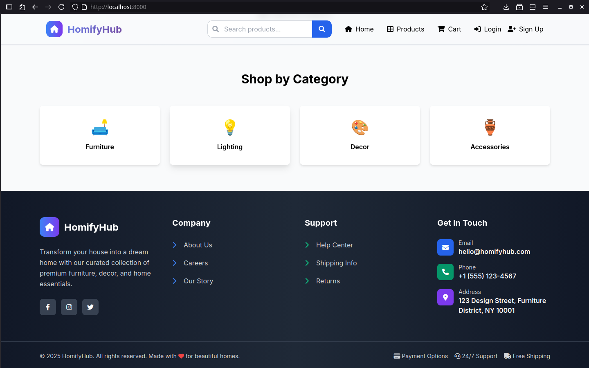
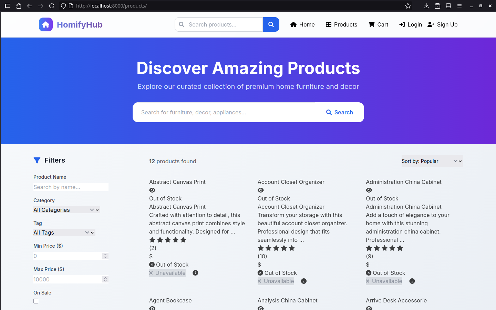
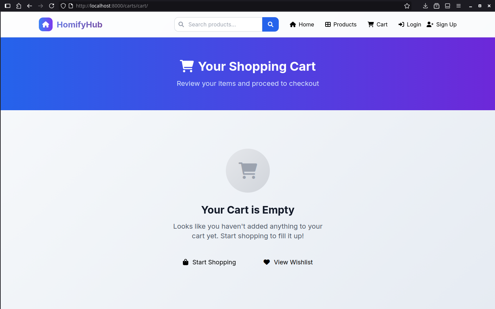

# HomifyHub

HomifyHub is a comprehensive e-commerce web application built with Django that allows users to browse, purchase, and manage home and lifestyle products. The platform features a modern design with social authentication, payment processing, and a full-featured shopping experience. This project is under active development and aims to provide a robust solution for online retail.

## Features

- **User Management**: Custom user authentication with social login (Google, Facebook)
- **Product Catalog**: Comprehensive product management with categories, images, and filtering
- **Shopping Cart & Wishlist**: Full cart functionality with persistent storage
- **Order Management**: Complete order processing and tracking system
- **Payment Processing**: Integrated payment gateway support
- **Blog System**: Content management for articles and updates
- **Admin Dashboard**: Full administrative interface for managing all aspects
- **Responsive Design**: Mobile-friendly interface using modern CSS frameworks

## Technology Stack

- **Backend**: Django 5.2.6
- **Database**: SQLite (development), PostgreSQL support (production)
- **Frontend**: Django templates with Jinja2, Bootstrap/Tailwind CSS
- **Authentication**: Django Allauth with social providers
- **Image Processing**: Django ImageKit
- **Task Queue**: Celery with Redis
- **Other**: Django Filter, Django Crispy Forms, WeasyPrint for PDFs

## Setup

### Prerequisites

- Python 3.8 or higher
- Git

### Installation

1. Clone the repository:

```bash
git clone https://github.com/jashezan/HomifyHub.git
cd HomifyHub
```

2. Create and activate a virtual environment:

```bash
python -m venv .venv
source .venv/bin/activate  # On Windows: .venv\Scripts\activate
```

3. Install dependencies:

```bash
pip install -r requirements.txt
```

4. Set up environment variables:

Copy `.env.local` to `.env` and configure your settings:

```bash
cp .env.local .env
```

Edit the `.env` file with your actual values:
- Database credentials (if using PostgreSQL)
- Secret key for Django
- API keys for social authentication
- External service credentials (Twilio, ImgBB)

5. Navigate to the Django project directory:

```bash
cd homifyhub
```

6. Apply database migrations:

```bash
python manage.py migrate
```

7. Create a superuser account:

```bash
python manage.py createsuperuser
```

8. Collect static files:

```bash
python manage.py collectstatic
```

## Running the Application

### Development Server

Start the Django development server:

```bash
cd homifyhub
python manage.py runserver
```

The application will be available at `http://localhost:8000`

### Using Makefile Commands

Alternatively, you can use the provided Makefile for common tasks:

```bash
# Run development server
make run

# Create database migrations
make makemigrations

# Apply migrations
make migrate

# Create superuser
make superuser

# Install dependencies
make install

# Run tests
make test

# See all available commands
make help
```

## Project Structure

```
HomifyHub/
├── homifyhub/                 # Main Django project directory
│   ├── manage.py             # Django management script
│   ├── homifyhub/            # Project settings
│   ├── core/                 # Core functionality and utilities
│   ├── users/                # User management and authentication
│   ├── products/             # Product catalog and management
│   ├── orders/               # Order processing and tracking
│   ├── carts/                # Shopping cart and wishlist
│   ├── payments/             # Payment processing
│   ├── blogs/                # Blog and content management
│   ├── site_settings/        # Site configuration
│   ├── templates/            # Global templates
│   └── static/               # Static files (CSS, JS, images)
├── media/                    # User uploaded files
├── requirements.txt          # Python dependencies
├── Makefile                  # Common development tasks
└── README.md                 # This file
```

## Configuration

### Environment Variables

Key environment variables in `.env`:

- `SECRET_KEY`: Django secret key
- `DEBUG`: Debug mode (True/False)
- `DB_*`: Database configuration
- `GOOGLE_CLIENT_ID` & `GOOGLE_SECRET`: Google OAuth
- `FACEBOOK_CLIENT_ID` & `FACEBOOK_SECRET`: Facebook OAuth
- `IMGBB_API_KEY`: Image hosting service
- `TWILIO_*`: SMS service configuration

### Database

The project uses SQLite by default for development. For production, configure PostgreSQL in your `.env` file.

## Development

### Creating a New App

```bash
python manage.py startapp app_name
```

Don't forget to add the new app to `INSTALLED_APPS` in settings.py.

### Running Tests

```bash
python manage.py test
# or
make test
```

### Code Quality

```bash
# Lint code
make lint

# Format code
make format
```

## Deployment

For production deployment:

1. Set `DEBUG=False` in your `.env` file
2. Configure your production database
3. Set up static file serving
4. Configure your web server (nginx/Apache)
5. Use a WSGI server like Gunicorn

## Contributing

1. Fork the repository
2. Create a feature branch (`git checkout -b feature/amazing-feature`)
3. Commit your changes (`git commit -m 'Add some amazing feature'`)
4. Push to the branch (`git push origin feature/amazing-feature`)
5. Open a Pull Request

## License

This project is open source. Please check the repository for license details.

## Support

For support or questions, please open an issue on the GitHub repository.

## Screenshots






